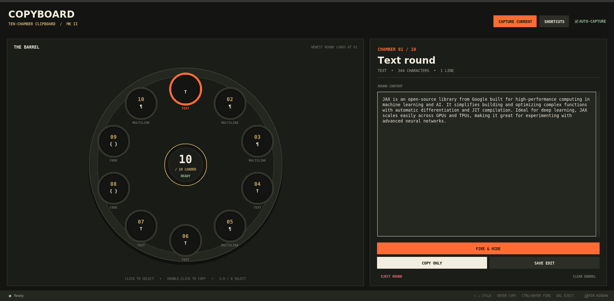
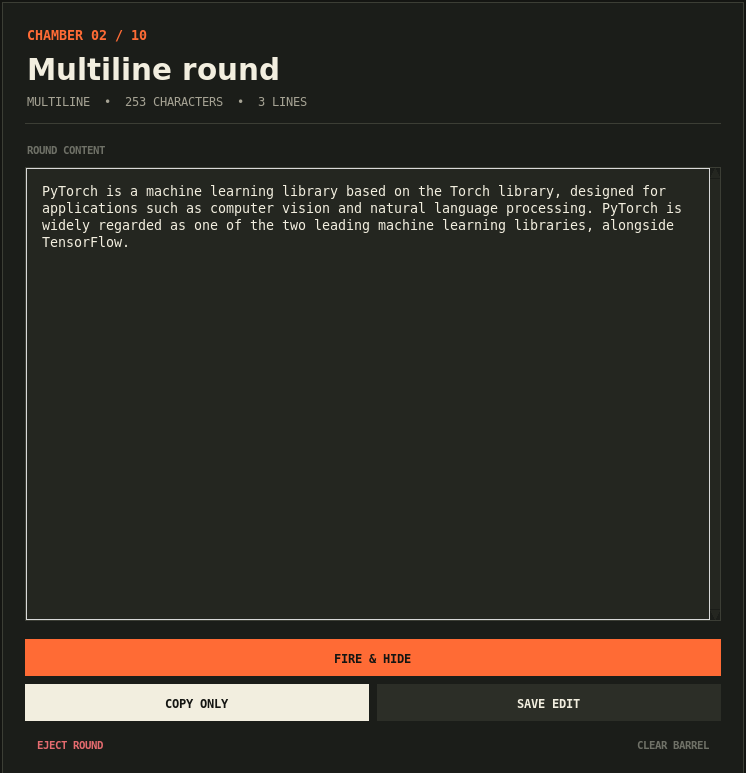

<p align="center">
  
</p>

<p align="center">A multi-clipboard utility for copying and pasting multiple items across all major platforms.</p>

## Download

Linux desktop releases are available from the
[GitHub Releases page](https://github.com/Dennis-J-Carroll/copyboard_app/releases):

- **Debian package (`.deb`)** — recommended for Ubuntu, Debian, and Linux Mint.
  Double-click the download to install CopyBoard in the application menu.
- **AppImage** — portable release for other x86-64 Linux distributions. Make
  it executable once, then double-click it to run. Automatic capture and paste
  still require the host system to provide `xclip` and `xdotool`.

The Linux release currently targets X11. Clipboard history and copy-only
features remain usable under XWayland, but automatic focus restoration and
pasting depend on `xdotool` and may be limited in native Wayland sessions.

Ever had to bounce between tabs or windows just to gather a handful of things you'd copied? CopyBoard fixes that: instead of one item overwriting your clipboard every time, you get a ten-chamber revolver of everything you've recently copied, ready to fire back out whenever you need it.

<p align="center">
  
</p>
<p align="center">
  
</p>

## Features

- Store multiple clipboard items
- Paste any item from history with keyboard shortcuts
- Combine multiple clipboard items
- System-wide hotkeys
- File manager integration
- Browser extension
- Cross-platform (Linux, macOS, Windows)

## Run the desktop app

CopyBoard now opens as a ten-chamber clipboard revolver. Each new copy loads
into chamber 01 and rotates older rounds clockwise.

```bash
# From a clone of this repository
python3 -m venv .venv
source .venv/bin/activate
pip install .
copyboard-gui
```

The app auto-captures new text copied anywhere on the desktop. Click a chamber
to inspect or edit it, **Copy Only** to place it back on the clipboard, or
**Fire & Hide** to minimise CopyBoard and paste into the previous app.

Choose **Widget Mode** (or press `Ctrl+Alt+C`) for a compact always-on-top
revolver. Hover to preview a round, click it to quick-paste, or hold and drag
before releasing for the same quick-fire gesture. The widget briefly hides,
returns focus to the previous app, pastes, and then reappears. Drag its header
to reposition it; right-click or press Escape to return to the full editor.

Keyboard controls:

- `1`–`9` and `0`: select chambers 01–10
- Arrow keys: rotate the selected chamber
- `Enter`: copy the selected round
- `Ctrl+Enter`: fire, hide, and paste
- `Ctrl+Shift+C`: capture the current clipboard
- `Delete`: eject the selected round

## Mobile direction

The maintained phone client is `copyboard_mobile_flutter`. It uses the same
ten-chamber revolver, explicit clipboard capture (required by current mobile
privacy rules), and native cross-app text dragging. Direct insertion into the
active field will use an iOS keyboard extension and an Android input method;
home-screen widgets are a secondary quick-access surface. See
[`docs/CROSS_PLATFORM_QUICK_PASTE.md`](docs/CROSS_PLATFORM_QUICK_PASTE.md) for
the platform methodology and delivery sequence.

On Linux, automatic paste requires `xdotool` on X11. Copy-only and clipboard
history remain available without it.

### Platform-Specific Installation

#### Linux

```bash
# Install dependencies
sudo apt install xdotool xclip python3-tk python3-pip

# Install Copyboard
pip install copyboard-extension

# Install system-wide
python3 scripts/install_system_wide.py
```

#### macOS

```bash
# Install dependencies
brew install python3

# Install Copyboard
pip3 install copyboard-extension

# Install system-wide
python3 scripts/install_system_wide.py
```

#### Windows

```bash
# Install Python from python.org
# Then install Copyboard
pip install copyboard-extension pywin32

# Install system-wide
python scripts/install_system_wide.py
```

## Usage

### GUI Mode

```bash
# Launch the GUI
copyboard-gui
```

### Command-Line Interface

```bash
# Show help
copyboard --help

# List all items in the clipboard board
copyboard list

# Copy an item at a specific index to the clipboard
copyboard copy 2

# Add text directly to the clipboard board
copyboard add "Some text to add"

# Clear the clipboard board
copyboard clear

# Paste a combination of items
copyboard paste-combo 0 2 3
```

### Global Hotkeys

- **Ctrl+Alt+C**: Open Copyboard GUI
- **Ctrl+Alt+X**: Copy current selection to Copyboard
- **Ctrl+Alt+V**: Paste from Copyboard (shows selection dialog)
- **Ctrl+Alt+B**: Paste combination (shows combination dialog)

## Browser Extension

The Copyboard browser extension allows you to use your clipboard board directly in web browsers.

### Installation

```bash
# Install the native messaging host
python3 scripts/install_browser_extension.py
```

Then load the unpacked extension from the `copyboard_extension/browser_extension` directory in Chrome, Firefox, or Edge.

## How It Works

Copyboard uses a simple list-based storage system to keep track of copied items. When you copy something, it's stored at the top of the list. When you paste, you can choose any item from the list.

The extension can run in multiple modes:
1. **GUI mode** - A graphical interface for easy interaction
2. **CLI mode** - Command-line tools for power users and scripting
3. **Library mode** - Import and use in your own Python code
4. **System-wide mode** - Global hotkeys for cross-application functionality
5. **File manager integration** - Integration with file managers on all platforms

## License

MIT

## Contributing

Contributions are welcome! Please feel free to submit a Pull Request.
