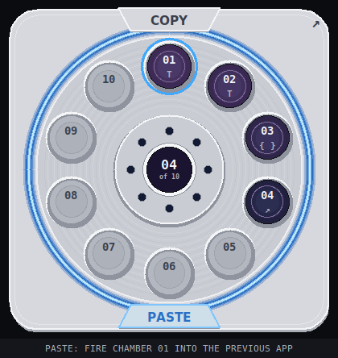
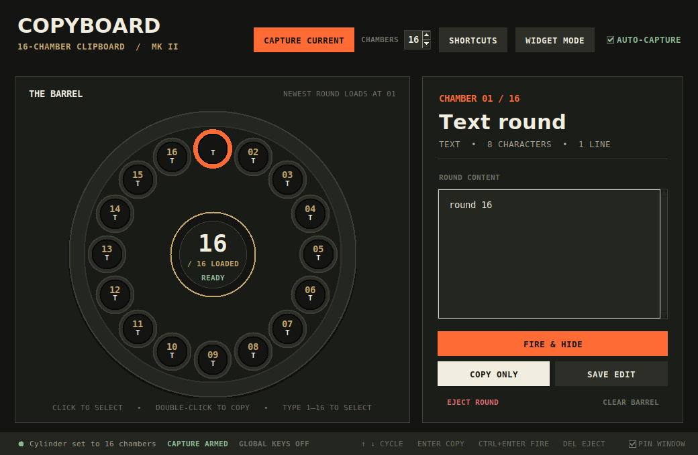

<p align="center">
  
</p>

<p align="center">A multi-clipboard utility for copying and pasting multiple items across all major platforms.</p>

## Download

Linux desktop releases are available from the
[GitHub Releases page](https://github.com/Dennis-J-Carroll/copyboard_app/releases):

- **Debian package (`.deb`)** — recommended for Ubuntu, Debian, and Linux Mint.
  Double-click the download to install CopyBoard in the application menu.
- **AppImage** — portable release for other x86-64 Linux distributions. Make
  it executable once, then double-click it to run. Automatic capture and paste
  still require the host system to provide `xclip` and `xdotool`.

The Linux release currently targets X11. Clipboard history and copy-only
features remain usable under XWayland, but automatic focus restoration and
pasting depend on `xdotool` and may be limited in native Wayland sessions.

Ever had to bounce between tabs or windows just to gather a handful of things
you'd copied? CopyBoard fixes that: instead of one item overwriting your
clipboard every time, you get a revolver of 10–16 chambers holding everything
you've recently copied, ready to fire back out whenever you need it.

<p align="center">
  
</p>
<p align="center">
  
</p>

## Features

- A cylinder of 10–16 numbered chambers; every new copy lands in chamber 01
- Fire any chamber into the app you came from with one shortcut, one click,
  or one hold-and-release, without the cylinder ever changing
- A compact quick-paste plate that opens under the pointer and gets out of the
  way the moment you let go
- Direct global shortcuts for every chamber, all editable, with conflict status
- Deliberate edit, eject, resize, and clear — nothing is deleted by pasting
- Combine chambers, file-manager integration, browser extension
- Local and offline; history lives in a plain JSON file you can read or delete
- Cross-platform (Linux, macOS, Windows)

## Run the desktop app

```bash
# From a clone of this repository
python3 -m venv .venv
source .venv/bin/activate
pip install .            # add '.[hotkeys]' for global shortcuts
copyboard-gui
```

### The cylinder

CopyBoard opens as a clipboard revolver with 10 chambers by default; the
**CHAMBERS** control in the header sets anything from 10 to 16. Each new copy
loads into chamber 01 and rotates older rounds clockwise; the oldest round is
evicted only when every chamber is full. Firing a chamber never moves, copies,
or ejects it. The cylinder only changes when you copy something new or
deliberately edit, eject, resize, or clear it; shrinking the cylinder asks
first and ejects only the oldest rounds.

The editor auto-captures new text copied anywhere on the desktop (pause it
with **AUTO-CAPTURE**; the footer always shows whether capture is armed).
Click a chamber to inspect or edit it, **COPY ONLY** to place it back on the
clipboard, or **FIRE & HIDE** to hide CopyBoard, return focus to the previous
app, and paste there.

### The quick-paste plate

**WIDGET MODE** (or `Ctrl+Alt+C`) opens the compact plate: a brushed-steel
squircle with a blue ring, dark recessed chambers, a hub showing the loaded
count, and **COPY** / **PASTE** tabs cut into the rim. It is built at startup
and opens with its hub under the mouse pointer, so the hand never travels.

The fast path is one gesture: hold a chamber, drag a little, let go. The plate
hides, focus returns to the app you came from, the round is pasted, and the
plate stays out of the way until you call it again. A plain click or the
**PASTE** tab does the same for the aimed chamber.

If focus cannot be returned (for example without `xdotool` on Linux) the round
stays on the clipboard and the plate says so, rather than pasting into the
wrong window. If no global shortcut is registered the plate reappears after a
paste so the app can always be reached.

| Plate control | Action |
| --- | --- |
| Hover, mouse wheel (pointer over the plate), `↑` `↓` | Aim at a round; never fires |
| `1`–`9`, `0`, or two quick digits (`1` then `4` = 14) | Aim by chamber number |
| Click a chamber, **PASTE** tab, `Enter`, `Space` | Fire the aimed round |
| Hold, drag, release | Fire and hide in one motion |
| **COPY** tab | Load the current clipboard into chamber 01 |
| `Delete` twice | Eject the aimed round (first press only arms it) |
| Drag bare steel | Move the plate |
| `Esc` or `Ctrl+Alt+C` | Dismiss the plate |
| Right-click or `↗` | Back to the full editor |

| Editor control | Action |
| --- | --- |
| `1`–`9`, `0`; two quick digits for 11–16 | Select a chamber |
| Arrow keys | Rotate the selection |
| `Enter` | Copy the selected round |
| `Ctrl+Enter` | Fire, hide, and paste into the previous app |
| `Ctrl+Shift+C` | Capture the current clipboard |
| `Ctrl+S` | Save an edit |
| `Delete` | Eject the selected round |
| Double-click | Copy a chamber immediately |

### Configuration

Settings live in `~/.config/copyboard/config.json`; the history itself is
`board.json` in the same folder, a plain JSON list of strings. Everything is
local and offline.

| Key | Default | Meaning |
| --- | --- | --- |
| `board.max_items` | `10` | Chambers in the cylinder, 10–16. Older values outside that range are clamped once on launch. |
| `board.auto_capture` | `true` | Load new external copies into chamber 01 |
| `window.widget_at_pointer` | `true` | Open the plate under the mouse pointer instead of its saved spot |
| `window.widget_reopen_after_fire` | `false` | Bring the plate back after every paste (always true when no shortcut can reopen it) |
| `hotkeys.*` | see below | Global shortcut combos, editable from **SHORTCUTS** |

## Mobile direction

The maintained phone client is `copyboard_mobile_flutter`. It uses the same
revolver model (currently fixed at ten chambers), explicit clipboard capture (required by current mobile
privacy rules), and native cross-app text dragging. Direct insertion into the
active field will use an iOS keyboard extension and an Android input method;
home-screen widgets are a secondary quick-access surface. See
[`docs/CROSS_PLATFORM_QUICK_PASTE.md`](docs/CROSS_PLATFORM_QUICK_PASTE.md) for
the platform methodology and delivery sequence.

On Linux, automatic paste requires `xdotool` on X11. Copy-only and clipboard
history remain available without it.

### Platform-Specific Installation

#### Linux

```bash
# Install dependencies
sudo apt install xdotool xclip python3-tk python3-pip

# Install Copyboard
pip install copyboard-extension

# Install system-wide
python3 scripts/install_system_wide.py
```

#### macOS

```bash
# Install dependencies
brew install python3

# Install Copyboard
pip3 install copyboard-extension

# Install system-wide
python3 scripts/install_system_wide.py
```

#### Windows

```bash
# Install Python from python.org
# Then install Copyboard
pip install copyboard-extension pywin32

# Install system-wide
python scripts/install_system_wide.py
```

## Usage

### GUI Mode

```bash
# Launch the GUI
copyboard-gui
```

### Command-Line Interface

```bash
# Show help
copyboard --help

# List all items in the clipboard board
copyboard list

# Copy an item at a specific index to the clipboard
copyboard copy 2

# Add text directly to the clipboard board
copyboard add "Some text to add"

# Clear the clipboard board
copyboard clear

# Paste a combination of items
copyboard paste-combo 0 2 3
```

### Global Hotkeys

Global shortcuts use the optional `keyboard` package
(`pip install 'copyboard-extension[hotkeys]'`; it needs root on Linux). Every
mapping is editable from **SHORTCUTS** in the app, which also shows whether
each combo registered, was rejected by the backend, or collides with another
action. Defaults:

- **Ctrl+Alt+C**: open or close the quick-paste widget
- **Ctrl+Alt+1 … Ctrl+Alt+9, Ctrl+Alt+0**: fire chambers 01–10 directly
- **Ctrl+Alt+Shift+1 … Ctrl+Alt+Shift+6**: fire chambers 11–16 directly
  (registered only when the cylinder has those chambers)
- **Ctrl+Shift+C**: capture the current clipboard
- **Ctrl+Shift+V**: paste chamber 01
- **Ctrl+Shift+A**: paste every chamber joined by newlines
- **Ctrl+Shift+→ / ←**: paste the next / previous chamber
- **Ctrl+Alt+B**: paste a combination (dialog)

Direct chamber shortcuts fire on key release so a held modifier never
corrupts the synthesised paste, and a paste triggered by CopyBoard itself is
never re-captured into chamber 01.

## Browser Extension

The Copyboard browser extension allows you to use your clipboard board directly in web browsers.

### Installation

```bash
# Install the native messaging host
python3 scripts/install_browser_extension.py
```

Then load the unpacked extension from the `copyboard_extension/browser_extension` directory in Chrome, Firefox, or Edge.

## How It Works

Copyboard keeps the history as a plain JSON list of strings in
`~/.config/copyboard/board.json`. A new copy goes to the front of the list, so
chamber 01 is list index 0. The CLI and Python API use those zero-based
indexes; the desktop app shows the one-based chamber labels 01–16.

The extension can run in multiple modes:
1. **GUI mode** - A graphical interface for easy interaction
2. **CLI mode** - Command-line tools for power users and scripting
3. **Library mode** - Import and use in your own Python code
4. **System-wide mode** - Global hotkeys for cross-application functionality
5. **File manager integration** - Integration with file managers on all platforms

## License

MIT

## Contributing

Contributions are welcome! Please feel free to submit a Pull Request.
